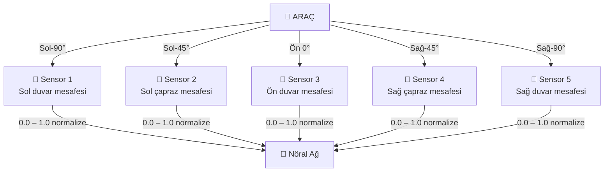
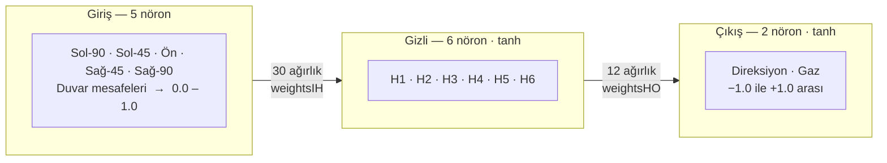
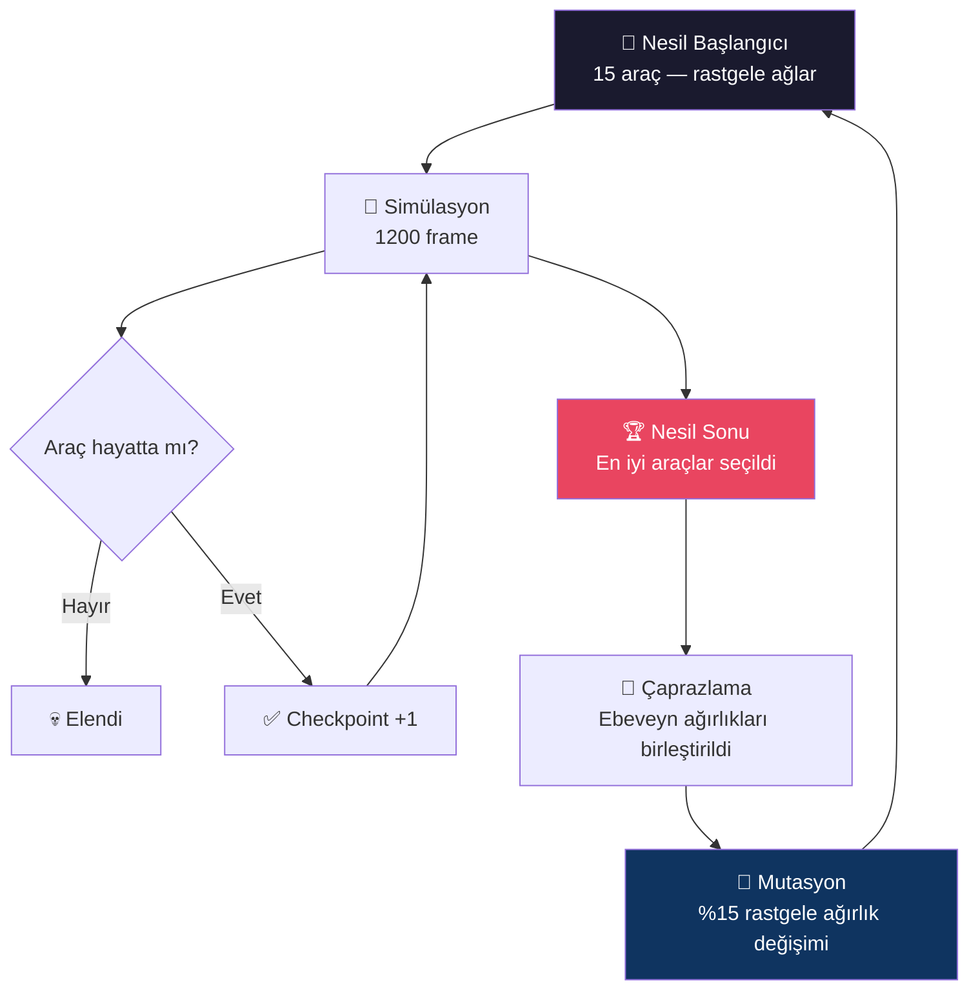

<div align="center">

[](https://developer.mozilla.org/en-US/docs/Web/JavaScript)
[](https://threejs.org/)
[](https://www.khronos.org/webgl/)
[](LICENSE)


**Kendi kendini evrimleştiren yapay zekâ araçlarının 3B yarış simülasyonu.**

**[▶ Canlı Demo](https://sayicon.github.io/NeuroRace/NeuroRace.html)**

</div>

---

## Proje Hakkında

NeuroRace, **nöral ağ** ve **genetik algoritma** kombinasyonu olan *nöroevülüsyon* (neuroevolution) tekniğini görselleştiren, tarayıcıda çalışan tek sayfalık bir simülasyondur. 15 araç, her nesilde daha iyi sürüş öğrenerek birbirleriyle yarışır — hiçbir kural elle yazılmaz, her şey evrim yoluyla öğrenilir.

---

## Nasıl Çalışır?

### Sensör Sistemi



### Nöral Ağ Mimarisi



### Genetik Algoritma (Evrim Döngüsü)



### Pist Döngüsü

Her 10 nesilde bir pist değişir:

| # | Pist Tipi | Özellik |
|:-:|-----------|---------|
| 1 | Organik | Kıvrımlı doğal yollar |
| 2 | Oval | Yüksek hız düzlüğü |
| 3 | Yıldız | Teknik keskin virajlar |
| 4 | Karmaşık | Çok katmanlı eğriler |

---

## Kullanılan Teknolojiler

| Teknoloji | Amaç |
|-----------|------|
| [Three.js r128](https://threejs.org/) | 3B grafik, kamera, ışıklandırma |
| WebGL | Donanım hızlandırmalı render |
| Canvas API | Nöral ağ görselleştirmesi |
| Tailwind CSS | Responsive dashboard arayüzü |
| Vanilla JS | Fizik, genetik algoritma, simülasyon döngüsü |

---

## Kurulum ve Çalıştırma

Herhangi bir kurulum veya sunucu gerekmez — tek dosya:

```bash
git clone https://github.com/Sayicon/NeuroRace.git
cd NeuroRace
start NeuroRace.html        # Windows
open NeuroRace.html         # macOS
xdg-open NeuroRace.html     # Linux
```

> Modern bir tarayıcı (Chrome, Firefox, Edge) yeterlidir.

---

## Yapılandırma

```javascript
const CONFIG = {
    carCount: 15,         // Aynı anda yarışan araç sayısı
    sensorCount: 5,       // Sensör sayısı
    mutationRate: 0.15,   // Mutasyon oranı (%15)
    generationTime: 1200, // Nesil uzunluğu (frame)
    maxSpeed: 1.5,        // Maksimum hız
    trackWidth: 18,       // Pist genişliği
    rayLength: 70,        // Sensör menzili
};
```

---

## Özellikler

- Gerçek zamanlı 3B render — Three.js ile WebGL destekli
- Nöral ağ görselleştirmesi — Ağırlıkları canlı gösteren bağlantı grafiği
- Simülasyon hız kontrolü — Hızlı nesil geçişi için x1–x10 hız
- Performans tablosu — Her araç için nesil, checkpoint ve sıralama bilgisi
- Pause / Resume desteği

---

## Neuroevolution Nedir?

Neuroevolution, nöral ağ ağırlıklarını **gradyan tabanlı geri yayılım (backpropagation) kullanmadan**, yalnızca evrimsel baskı ile optimize eden bir yaklaşımdır. Etiketli veri seti gerektirmez; hayatta kalma yeterliliği yeterlidir.

NeuroRace'de bu prensip doğrudan uygulanır: araçlar sürmeyi kimseye sormadan, sadece hayatta kalmaya çalışarak öğrenir.

---

<div align="center">

[](https://github.com/Sayicon)

</div>


